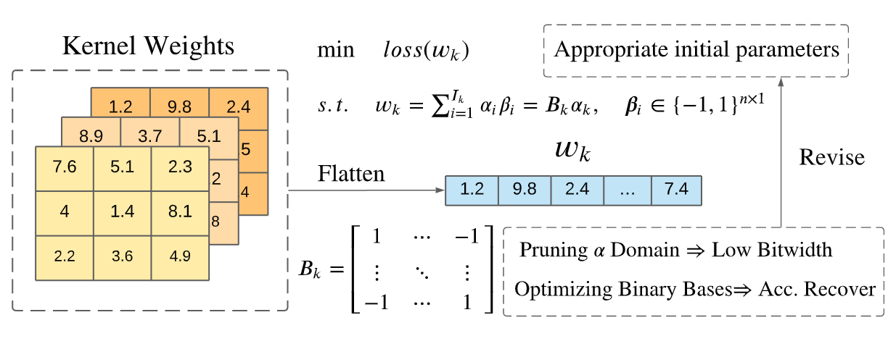

# ECG-Classification


The project is based on SEU SRTP.
Dataset: MIT-BIH.

- Implementation of Paper "[Arrhythmia Classifier Using Convolutional Neural Network with Adaptive Loss-aware Multi-bit Networks Quantization](https://arxiv.org/abs/2202.12943)" using Pytorch [code open].

Cardiovascular disease (CVDs) is one of the uni-
versal deadly diseases, and the detection of it in the early
stage is a challenging task to tackle. Recently, deep learning
and convolutional neural networks have been employed widely
for the classification of objects. Moreover, it is promising that
lots of networks can be deployed on wearable devices. An
increasing number of methods can be used to realize ECG signal
classification for the sake of arrhythmia detection. However, the
existing neural networks proposed for arrhythmia detection are
not hardware-friendly enough due to a remarkable quantity of
parameters resulting in memory and power consumption. In this
paper, we present a 1-D adaptive loss-aware quantization, achieving a high compression rate that reduces memory consumption
by 23.36 times. In order to adapt to our compression method, we
need a smaller and simpler network. We propose a 17 layer end-
to-end neural network classifier to classify 17 different rhythm
classes trained on the MIT-BIH dataset, realizing a classification
accuracy of 93.5%, which is higher than most existing methods.
Due to the adaptive bitwidth method making important layers get
more attention and offered a chance to prune useless parameters,
the proposed quantization method avoids accuracy degradation.
It even improves the accuracy rate, which is 95.84%, 2.34%
higher than before. Our study achieves a 1-D convolutional neural
network with high performance and low resources consumption,
which is hardware-friendly and illustrates the possibility of
deployment on wearable devices to realize a real-time arrhythmia
diagnosis.


- Applied a new Quantization Compression Method applied to the networks (ALQ)



- Blog: [Arrhythmia Classifier Using Convolutional Neural Network with Adaptive Loss-aware Multi-bit Networks Quantization](https://preminstrel.github.io/blog/post/2021/10/17/arrhythmia-classifier-using-cnn-with-alq/)


## Citation
```tex
@INPROCEEDINGS{sun2022arrhythmia,
  author={Sun, Hanshi and Wang, Ao and Pu, Ninghao and Li, Zhiqing and Huang, Junguang and Liu, Hao and Qi, Zhi},
  booktitle={2021 2nd International Conference on Artificial Intelligence and Computer Engineering (ICAICE)},
  title={Arrhythmia Classifier Using Convolutional Neural Network with Adaptive Loss-aware Multi-bit Networks Quantization},
  year={2021},
  volume={},
  number={},
  pages={461-467},
  doi={10.1109/ICAICE54393.2021.00095}
}
```

## Acknowledgement
- [Adaptive Loss-aware Quantization for Multi-bit Networks](https://github.com/zqu1992/ALQ)
